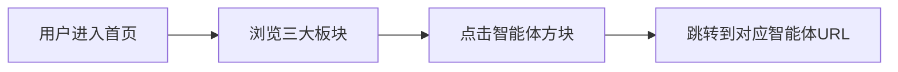

## 1. Product Overview
OPC AI智能体超市是一个展示和访问各类AI智能体的门户网站，为用户提供一站式的AI工具使用体验。
- 主要目的：作为AI智能体的统一入口，方便用户快速访问各类专业智能体
- 目标用户：企业决策者、产品经理、营销人员、自媒体创作者
- 市场价值：打造AI产业联盟的核心平台，整合各类AI能力

## 2. Core Features

### 2.1 User Roles
| Role | Registration Method | Core Permissions |
|------|---------------------|------------------|
| 访客 | 无需注册 | 浏览和点击访问智能体 |

### 2.2 Feature Module
1. **首页**: 品牌展示区、三大板块导航、智能体列表

### 2.3 Page Details
| Page Name | Module Name | Feature description |
|-----------|-------------|---------------------|
| 首页 | Hero区域 | 品牌标语、动态背景效果 |
| 首页 | 战略板块 | 展示商业洞察专家、品牌营销策划专家、商业谈判专家 |
| 首页 | 产品板块 | 展示产品策划专家 |
| 首页 | 营销板块 | 展示小红书生产机器、潘多拉智能体、爆款复刻、IP内容生产、热点短视频文案编导、批量自媒体文案 |

## 3. Core Process
用户进入首页 → 浏览三大板块 → 点击感兴趣的智能体方块 → 跳转到对应的智能体使用页面

## 4. User Interface Design

### 4.1 Design Style
- 主色调：深色背景(#0a0a0f)配合霓虹蓝(#00d4ff)和紫色(#a855f7)
- 按钮样式：玻璃拟态效果，hover时有光晕和位移动画
- 字体：Orbitron（科技感标题）+ Rajdhani（正文）
- 布局：卡片式网格布局，层次分明
- 图标：科技感线条图标

### 4.2 Page Design Overview
| Page Name | Module Name | UI Elements |
|-----------|-------------|-------------|
| 首页 | Hero区域 | 动态背景粒子效果、渐变标题、品牌标语 |
| 首页 | 板块标题 | 发光边框、渐变文字、装饰性线条 |
| 首页 | 智能体卡片 | 玻璃拟态卡片、hover光晕效果、动态阴影、图标 |

### 4.3 Responsiveness
- 桌面端：三列板块并列展示
- 平板端：两列布局
- 移动端：单列布局，卡片垂直排列

### 4.4 3D Scene Guidance
- 背景使用粒子动画模拟科技感
- 卡片hover时有3D倾斜效果
- 光晕和阴影动态变化