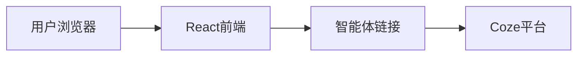
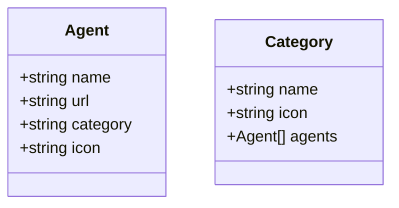

## 1. Architecture Design


## 2. Technology Description
- Frontend: React@18 + TypeScript + tailwindcss@3 + vite@6
- Initialization Tool: vite-init
- Backend: None（纯前端静态网站）
- Database: None（无需数据库）

## 3. Route Definitions
| Route | Purpose |
|-------|---------|
| / | 首页，展示三大板块和所有智能体 |

## 4. API Definitions
无需后端API，纯前端静态页面

## 5. Server Architecture Diagram
无需后端服务器

## 6. Data Model

### 6.1 Data Model Definition


### 6.2 Data Definition Language
无需数据库，数据通过JSON文件存储

## 7. Project Structure
```
src/
├── components/
│   ├── Hero.tsx           # 英雄区域组件
│   ├── CategorySection.tsx # 板块区域组件
│   └── AgentCard.tsx      # 智能体卡片组件
├── data/
│   └── agents.ts          # 智能体数据
├── App.tsx                # 主应用组件
├── main.tsx               # 入口文件
└── index.css              # 全局样式
```